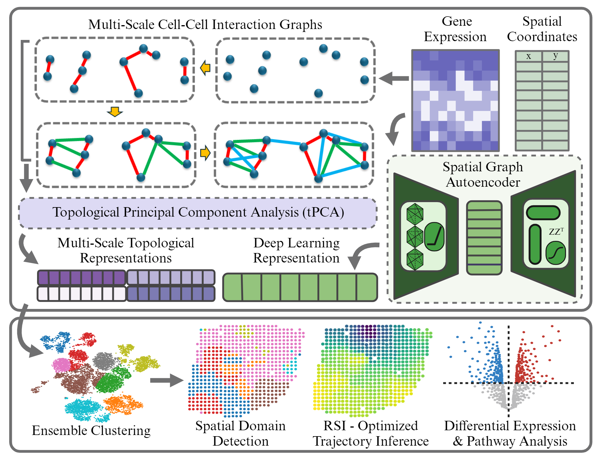

# MCIST- MultiScale Cell-Cell Interactive Spatial Transcriptomics Analysis 

MCIST unites the strengths of spatially aware graph deep learning with an ensemble of multiscale topological representations of cell-cell interactions in the gene expression space. 

In this repository we present the files needed to reproduce the clustering benchmarking results stated in our paper. The code for Topological PCA and MCIST is provided along with an environment setup file. If you wish to personally access each of the spatial deep learning packages- STAGATE is available at https://github.com/zhanglabtools/STAGATE. SpaceFlow is available at https://github.com/hongleir/SpaceFlow. GraphST is available at https://github.com/JinmiaoChenLab/GraphST. The reproducible environment setups matching the results of the benchmarking study can be found with their pipeline at https://github.com/zhaofangyuan98/SDMBench. 

# Benchmark Validation Tests
Once your workspace is properly set, you can run the tests for each dataset by specifying the argument (i.e. python ST.py 'H1' or python Visium_DLPFC.py '151674'). 

# Data 
All of the datasets referenced in the paper are publicly available in .h5ad format at our lab website https://weilab.math.msu.edu/DataLibrary/SpatialTranscriptomics/.  

# RS Index
The unsupervised optimization of MCIST relies on computation of the Residue Similarity Index metric. The code for calculating this metric can be downloaded at: https://github.com/hozumiyu/CCP-for-Single-Cell-RNA-Sequencing/tree/main/codes/RSI. 

# Citations 
Sean Cottrell, Yuta Hozumi, and Guo-Wei Wei. K-nearest-neighbors induced topological pca for single cell rna-sequence data analysis. Computers in Biology and Medicine, page 108497, 2024

Kangning Dong and Shihua Zhang. Deciphering spatial domains from spatially resolved transcriptomics with an adaptive graph attention auto-encoder. Nature communications, 13(1):1739, 2022

Yahui Long, Kok Siong Ang, Mengwei Li, Kian Long Kelvin Chong, Raman Sethi, Chengwei Zhong, Hang Xu, Zhiwei Ong, Karishma Sachaphibulkij, Ao Chen, et al. Spatially informed clustering, integration, and deconvolution of spatial transcriptomics with graphst. Nature Communications, 14(1):1155, 2023.

Honglei Ren, Benjamin L Walker, Zixuan Cang, and Qing Nie. Identifying multicellular spatiotemporal organization of cells with spaceflow. Nature communications, 13(1):4076, 2022

Zhiyuan Yuan, Fangyuan Zhao, Senlin Lin, Yu Zhao, Jianhua Yao, Yan Cui, Xiao-Yong Zhang, and Yi Zhao. Benchmarking spatial clustering methods with spatially resolved transcriptomics data. Nature Methods, pages 1–11, 2024
